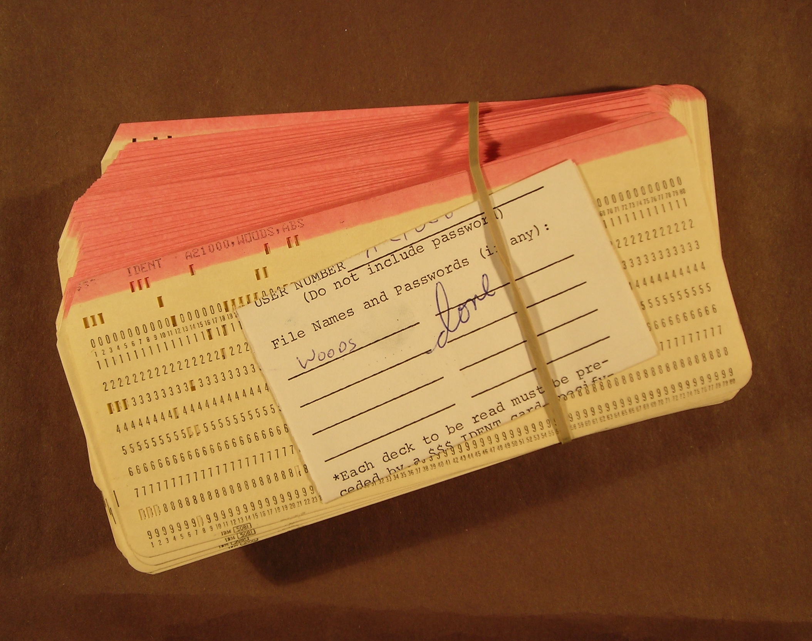
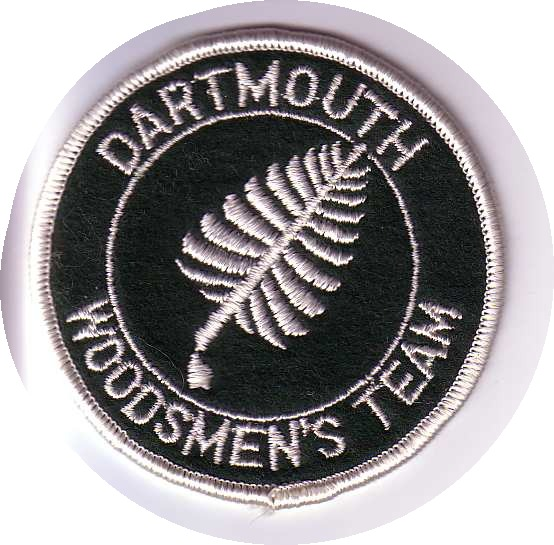

# Spring Meet archive

The “Spring Meet” is an annual competition, started at Dartmouth College in 1947, that celebrates the old-time forestry skills used in the woods.
It was traditionally known as Woodsmen's Weekend (WW), though at times it has been known as Timber Sports Weekend, Logging Sports Championship, Dartmouth Logging Days, or just as "Spring Meet".
The 1992 event program contained a brief history [[history1947-1992.pdf](files/history1947-1992.pdf)] from 1947-1992.

Please contact me (David Kotz '86) if you have information or records I can add.

Many thanks to those who have contributed information or materials: Elaine Anderson '83, Put Blodgett '53, Phil Bracikowski '08, Julie Clemons, Marty Dodge (FLCC), Kevin Donohue '21, Rory Gawler ‘05, Sam Nijensohn '98, Jim Taylor '74, and ASE Thomas '91.

# Winners

See notes below the table.
***Need to find/verify results in 2016 until date.***

| Year | Men's | Women's | Jack & Jill |
| ----: | ----- | :---- | :---- |
| 2025 | ESF | ESF  | ESF  |
| 2024 | *missing* | *missing*  | *missing*  |
| 2023 | (*) | (*) | Paul Smith’s |
| 2022 | *missing* | *missing*  | *missing*  |
| 2021 | *no meet due to pandemic* |  |  |
| 2020 | *no meet due to pandemic* |  |  |
| 2019 | *missing*  | *missing*  | FLCC |
| 2018 | *missing*  | *missing*  | Paul Smith's |
| 2017 | *missing*  | *missing*  | Paul Smith's |
| 2016 | Alfred State | Colby | Paul Smith's? |
| 2015 | Paul Smith's | Colby | FLCC |
| 2014 | FLCC | Colby | Alfred State |
| 2013 | FLCC | Colby | Alfred State |
| 2012 | ESF | ESF | Paul Smith's |
| 2011 | FLCC | Colby | ESF |
| 2010 | FLCC | Paul Smith's | Paul Smith's |
| 2009 | Paul Smith's | ESF |  |
| 2008 | FLCC | ESF |  |
| 2007 | Paul Smith's | Colby |  |
| 2006 | NSAC | NSAC |  |
| 2005 | ESF | ESF |  |
| 2004 | FLCC | ESF |  |
| 2003 | Paul Smith's | Paul Smith's |  |
| 2002 | FLCC | FLCC |  |
| 2001 | FLCC | FLCC |  |
| 2000 | NSAC | FLCC |  |
| 1999 | ESF | ESF |  |
| 1998 | FLCC | ESF |  |
| 1997 | FLCC | ESF\* (was SSFC) |  |
| 1996 | FLCC | FLCC |  |
| 1995 | ESF | FLCC |  |
| 1994 | FLCC | SSFC |  |
| 1993 | FLCC | FLCC |  |
| 1992 | Pinkerton | FLCC |  |
| 1991 | FLCC | FLCC |  |
| 1990 | FLCC | ESF |  |
| 1989 | Pinkerton | Dartmouth |  |
| 1988 | FLCC | FLCC |  |
| 1987 | FLCC | SSFC\* (was FLCC) |  |
| 1986 | FLCC | FLCC |  |
| 1985 | FLCC | Dartmouth |  |
| 1984 | Paul Smith's | FLCC |  |
| 1983 | FLCC | Dartmouth |  |
| 1982 | Unity | FLCC |  |
| 1981 | Maine | Dartmouth |  |
| 1980 | Dartmouth | FLCC |  |
| 1979 | Maine | Maine |  |
| 1978 | Dartmouth | Paul Smith's |  |
| 1977 | Maine | Colby |  |
| 1976 | Paul Smith's | Dartmouth |  |
| 1975 | Maine | Maine |  |
| 1974 | Maine | Maine |  |
| 1973 | Paul Smith's | Colby |  |
| 1972 | Paul Smith's |  |  |
| 1971 | Maine |  |  |
| 1970 | Maine |  |  |
| 1969 | Nichols |  |  |
| 1968 | Maine |  |  |
| 1967 | Colby |  |  |
| 1966 | Nichols |  |  |
| 1965 | Paul Smith's |  |  |
| 1964 | Paul Smith's |  |  |
| 1963 | Paul Smith's |  |  |
| 1962 | Paul Smith's |  |  |
| 1961 | Paul Smith's |  |  |
| 1960 | Paul Smith's |  |  |
| 1959 | Paul Smith's |  |  |
| 1958 | Paul Smith's |  |  |
| 1957 | Paul Smith's |  |  |
| 1956 | Dartmouth |  |  |
| 1955 | Dartmouth |  |  |
| 1954 | Middlebury |  |  |
| 1953 | Dartmouth |  |  |
| 1952 | Middlebury |  |  |
| 1951 | Dartmouth |  |  |
| 1950 | Dartmouth |  |  |
| 1949 | Dartmouth |  |  |
| 1948 | Dartmouth |  |  |
| 1947 | Dartmouth |  |  |

## Abbreviations:
FLCC = Finger Lakes Community College

SSFC = Sir Sanford Fleming College

ESF = SUNY College of Environmental Science and Forestry

NSAC = Nova Scotia Agricultural College

## Notes:
David Kotz obtained a list of winners through 1995 from the 1996 program produced by FLCC; however, research in the Dartmouth archives indicates 1972 winner was Paul Smith's B, not Maine.

Marty Dodge (FLCC) provided David Kotz with a list of winners for non-Dartmouth meets 1996-2009.

Where the trophy differed from reports by individuals, David Kotz trusted the trophy.

* At the 2015 spring meet David Kotz verified recent winners for Men's (1988-2014), Women's (1986-2014), and J&J (2010-2014) by inspecting the trophies on-site (which have gaps for 1998 Women's and 2012 J&J).

* At the 2023 spring meet David Kotz verified recent winners for 2013 (Alfred State), 2014 (Alfred State), 2015 (FLCC), 2016 (blank), 2017 (Paul Smith’s), 2018 (Paul Smith’s), 2019 (FLCC), by inspecting the one trophy on-site.

(*) At the 2023 spring meet there was only one scored division - Jack & Jill; there were no Men’s and Women’s teams scored for awards.

# Chronology - hosts, rules, results, and programs

Here are links to rules, results, and programs over the years, listed by year, along with the host school.
Please help fill in the gaps!

- **2026** at ESF (April 25/26)
- **2025** at ? ***(please help)***
- **2024** at Paul Smith's College [[schedule2024.pdf](files/schedule2024.pdf)] [[schedule2024.docx](files/schedule2024.docx)] [[rules2024.pdf](files/rules2024.pdf)] [[results2024.pdf](files/results2024.pdf)]
- **2023** at Dartmouth [[program2023.docx](files/program2023.docx)]  [[program2023.pdf](files/program2023.pdf)] [rules] [[results2023.pdf](files/results2023.pdf)] [[results2023.xlsx](files/results2018.xlsx)] [[photos](https://dartoutclub.smugmug.com/FTD/2021F-2022S/Spring-meet-23-photos)]
- **2022** at ? ***(please help)***
- **2021** (no meet due to the pandemic)
- **2020** (no meet due to the pandemic)

---
- **2019** at Cobleskill ***(please verify)*** [[results2019.pdf](files/results2019.pdf)] [[results2019.xlsx](files/results2019.xlsx)] 
- **2018** at Dartmouth [[results2018.pdf](files/results2018.pdf)] [[results2018.xlsx](files/results2018.xlsx)] 
- **2017** at Paul Smith’s ***(please verify)***
- **2016** at Alfred State [[results2016.pdf](files/results2016.pdf)] [[results2016.xlsx](files/results2016.xlsx)] [[rules2016.pdf](files/rules2016.pdf)] [[rules2016.docx](files/rules2016.docx)]
- **2015** at Dartmouth [[schedule2015.pdf](files/schedule2015.pdf)] [[results2015.pdf](files/results2015.pdf)] [[results2015.xlsx](files/results2015.xlsx)] [[rules2015.pdf](files/rules2015.pdf)] [[DOC photos](https://dartoutclub.smugmug.com/FTD/2018-2010/14F-15S/WW2015)] [[Dartmouth news](https://home.dartmouth.edu/news/2015/04/weekend-woods)]
- **2014** at SUNY Cobleskill [[rules2014.pdf](files/rules2014.pdf)] [[rules2014.docx](files/rules2014.docx)]
- **2013** at FLCC [[rules2013.pdf](files/rules2013.pdf)]
- **2012** at Dartmouth [[program2012.pdf](files/program2012.pdf)] [[program2012.doc](files/program2012.doc)] [[results2012.pdf](files/results2012.pdf)] [[results2012-adjusted.pdf](files/results2012-adjusted.pdf)] [[results2012.xlsx](files/results2012.xlsx)] [[results2012-adjusted.xlsx](files/results2012-adjusted.xlsx)] [[rules2012.pdf](files/rules2012.pdf)] [[rules2012.doc](files/rules2012.doc)] [[DOC photos](https://dartoutclub.smugmug.com/CnT/FTD/Spring-Meet-2012/22762176_WcJgLX)] [[cnjacobs photos](https://gallery.me.com/cnjacobs#gallery) BROKEN] [[YouTube playlist](https://www.youtube.com/playlist?list=PL42BAB49BAAE65025)] [[pjb photos](https://pjb.smugmug.com/Dartmouth-Outing-Club/Forestry-Team/Woodsmens-Weekend-2012)]
- **2011** at SUNY Cobleskill [[results2011.pdf](files/results2011.pdf)] [[results2011.xlsx](files/results2011.xlsx)] [[rules2011.pdf](files/rules2011.pdf)] [[rules2011.docx](files/rules2011.docx)]
- **2010** at Paul Smith's [[results2010.pdf](files/results2010.pdf)] [[resultsstihl2010.pdf](files/resultsstihl2010.pdf) (Stihl)] [[rules2010.pdf](files/rules2010.pdf)] [[rules2010.doc](files/rules2010.doc)]

---
- **2009** at Dartmouth [[program2009.pdf](files/program2009.pdf)] [[results2009.pdf](files/results2009.pdf)] [[results2009.xls](files/results2009.xls)] [[rules2009.pdf](files/rules2009.pdf)] [[rules2009.doc](files/rules2009.doc)] [[Kendrick's photos](https://picasaweb.google.com/gckendrick/2009WoodsmensWeekend?authkey=Gv1sRgCLyVqqPviImDkwE&feat=directlink) BROKEN] [[cavandyke's photos](https://picasaweb.google.com/lh/sredir?uname=cavandyke46&target=ALBUM&id=5330297888880078673&authkey=Gv1sRgCPvaidHiu9jOrgE&authkey=Gv1sRgCPvaidHiu9jOrgE&feat=directlink) BROKEN] [[pjb's photos](https://pjb.smugmug.com/gallery/8106610_hZy8q#528895224_7nQQj)]
- **2008** at UNH [[program2008.pdf](files/program2008.pdf)] [[results2008.pdf](files/results2008.pdf)] [[rules2008.pdf](files/rules2008.pdf)] [[DOC photos](https://dartoutclub.smugmug.com/FTD/Spring-Meets-2001-2009/Woodsmens-Weekend-2008)] [[pjb's photos](https://pjb.smugmug.com/gallery/3768826_UMuAc)]
- **2007** at Dartmouth [[program2007.pdf](files/program2007.pdf)] [[results2007.pdf](files/results2007.pdf)] [[results2007.xls](files/results2007.xls)][[rules2007.pdf](files/rules2007.pdf)] [[rules2007.doc](files/rules2007.doc)] [[DOC photos](https://dartoutclub.smugmug.com/FTD/Spring-Meets-2001-2009/Woodsmens-Weekend-2007)]
- **2006** at NSAC [[DOC photos](https://dartoutclub.smugmug.com/FTD/Spring-Meets-2001-2009/Woodsmens-Weekend-2006)]
- **2005** at FLCC [[rules2005.pdf](files/rules2005.pdf)] [[rules2005.doc](files/rules2005.doc)]
- **2004** at Dartmouth [[program2004.pdf](files/program2004.pdf)] [[results2004mens.pdf](files/results2004mens.pdf)-M] [[results2004mens.xls](files/results2004mens.xls)-M] [[results2004womens.pdf](files/results2004womens.pdf)-W] [[results2004womens.xls](files/results2004womens.xls)-W] [[rules2004.pdf](files/rules2004.pdf)] [[DOC photos](https://dartoutclub.smugmug.com/FTD/Spring-Meets-2001-2009/Woodsmens-Weekend-2004)] [[heatherlapin's photos](https://gallery.mac.com/heatherlapin#100000) BROKEN?]
- **2003** at Colby [[DOC photos](https://dartoutclub.smugmug.com/FTD/Spring-Meets-2001-2009/Woodsmens-Weekend-2003)]
- **2002** at Unity [[DOC photos](https://dartoutclub.smugmug.com/FTD/Spring-Meets-2001-2009/Woodsmens-Weekend-2002)]
- **2001** at Dartmouth [[program2001.pdf](files/program2001.pdf)] [[results2001.pdf](files/results2001.pdf)] [[results2001.xls](files/results2001.xls)] [[rules2001.pdf](files/rules2001.pdf)] [[DOC photos](https://dartoutclub.smugmug.com/FTD/Spring-Meets-2001-2009/Woodsmens-Weekend-2001)]
- **2000** at Nova Scotia Agriculture College (NSAC)

---
- **1999** at FLCC [[program1999.pdf](files/program1999.pdf)]
- **1998** at Dartmouth [[program1998.pdf](files/program1998.pdf)]
- **1997** at Paul Smith's College
- **1996** at FLCC [[program1996.pdf](files/program1996.pdf)]
- **1995** at Dartmouth [[program1995.pdf](files/program1995.pdf)] [[results1995.pdf](files/results1995.pdf)]
- **1994** at Colby
- **1993** at Pinkerton
- **1992** at Dartmouth [[program1992.pdf](files/program1992.pdf)] [[results1992.pdf](files/results1992.pdf)]
- **1991** at FLCC
- **1990** at UMO

---
- **1989** at Dartmouth [[program1989.pdf](files/program1989.pdf)] [[results1989.pdf](files/results1989.pdf)]
- **1988** at Colby [[program1988.pdf](files/program1988.pdf)] [[rules1988.pdf](files/rules1988.pdf)]
- **1987** at FLCC [[results1987a.pdf](files/results1987a.pdf)-v1] [[results1987b.pdf](files/results1987b.pdf)-v2]
- **1986** at Dartmouth [[program1986.pdf](files/program1986.pdf)] [[results1986.pdf](files/results1986.pdf)] [[song1986.pdf](files/song1986.pdf)] [[woodsmoke1986.pdf](files/woodsmoke1986.pdf)]
- **1985** at UMO [[program1985.pdf](files/program1985.pdf)] [[results1985.pdf](files/results1985.pdf)] [[woodsmoke1985.pdf](files/woodsmoke1985.pdf)]
- **1984** at Paul Smith's [[program1984.pdf](files/program1984.pdf)] [[rules1984.pdf](files/rules1984.pdf)] [[woodsmoke1984.pdf](files/woodsmoke1984.pdf)]
- **1983** at Dartmouth [[program1983.pdf](files/program1983.pdf)] [[rules1983.pdf](files/rules1983.pdf)] [[results1983.pdf](files/results1983.pdf)] [[press1983.pdf](files/press1983.pdf)] [[team1983.pdf](files/team1983.pdf)]
- **1982** at Colby [[program1982.pdf](files/program1982.pdf)] [[rules1982.pdf](files/rules1982.pdf)] [[results1982.pdf](files/results1982.pdf)] [[woodsmoke1982.pdf](files/woodsmoke1982.pdf)]
- **1981** at CCFL (now FLCC) [[program1981.pdf](files/program1981.pdf)] [[results1981.pdf](files/results1981.pdf)] [[rules1981.pdf](files/rules1981.pdf)] [[woodsmoke1981.pdf](files/woodsmoke1981.pdf)]
- **1980** at Dartmouth [[program1980.pdf](files/program1980.pdf)] [[results1980.pdf](files/results1980.pdf)] [[rules1980.pdf](files/rules1980.pdf)] [[press-release1980.pdf](files/press-release1980.pdf)]

---
- **1979** at UMO [[results1979.pdf](files/results1979.pdf)]
- **1978** at Colby [[results1978.pdf](files/results1978.pdf)] [[press-release1978.pdf](files/press-release1978.pdf)][[thed_may7_1978.pdf](files/thed_may7_1978.pdf)]
- **1977** at Dartmouth [[program1977.pdf](files/program1977.pdf)] [[results1977.pdf](files/results1977.pdf)] [[rules1977.pdf](files/rules1977.pdf)][[woodsmokespr77.pdf](files/woodsmokespr77.pdf)][[thed_may3_1977.pdf](files/thed_may3_1977.pdf)][[thed_may2_1977.pdf](files/thed_may2_1977.pdf)]
- **1976** at UNH [[results1976.pdf](files/results1976.pdf)][[thed_apr15_1976.pdf](files/thed_apr15_1976.pdf)][[thed_unhmeet_1976.pdf](files/thed_unhmeet_1976.pdf)][[woodsmokemarch76.pdf](files/woodsmokemarch76.pdf)]
- **1975** at UMO [[woodsmoke1975.pdf](files/woodsmoke1975.pdf)]
- **1974** at Dartmouth [[program1974.pdf](files/program1974.pdf)] [[rules1974.pdf](files/rules1974.pdf)]
- **1973** at Colby [[rules1973.pdf](files/rules1973.pdf)]
- **1972** at Dartmouth [[program1972.pdf](files/program1972.pdf)] [[results1972.pdf](files/results1972.pdf)] [[rules1972.pdf](files/rules1972.pdf)]
- **1971** at Paul Smith's
- **1970** at Dartmouth - not.  In Hanover in 1972 it was generally known that 1966 was the most recent at DC.

---
- **1969** at Nichols
- **1968** at UMass [[results1968.pdf](files/results1968.pdf)]
- **1967** at ? [[results1967.pdf](files/results1967.pdf)]
- **1966** at Dartmouth [[schedule1966.pdf](files/schedule1966.pdf)] [[results1966.pdf](files/results1966.pdf)] [[rules1966.pdf](files/rules1966.pdf)]
- **1965** at
- **1964** at West Point [[results1964.pdf](files/results1964.pdf)] [[rules1964.pdf](files/rules1964.pdf)]
- **1963** at
- **1962** at
- **1961** at
- **1960** at

---
- **1959** at Dartmouth
- **1958** at UMO
- **1957** at Middlebury
- **1956** at Paul Smith's [[schedule1956.pdf](files/schedule1956.pdf)] [[results1956.pdf](files/results1956.pdf)] [[rules1956.pdf](files/rules1956.pdf)]
- **1955** at Kimball Union Academy
- **1954** at Dartmouth  [[results1954.pdf](files/results1954.pdf)] [[rules1954.pdf](files/rules1954.pdf)]
- **1953** at UMO
- **1952** at Middlebury  [[results1952.pdf](files/results1952.pdf)]
- **1951** at Dartmouth  [[results1951.pdf](files/results1951.pdf)] [[rules1951.pdf](files/rules1951.pdf)]
- **1950** at Dartmouth  [[results1950.pdf](files/results1950.pdf)]

---
- **1949** at Dartmouth [[results1949.pdf](files/results1949.pdf)] [[rules1949.pdf](files/rules1949.pdf)]
- **1948** at Dartmouth
- **1947** at Dartmouth

---

# Undated documents (help needed!)

Unfortunately, some of the documents we've found do not have dates.  Please help us out. 
Maybe you have a copy of one of these in your home collection.  Maybe you can correlate the 
events listed in rules with those on results or a program to rule out, or rule in, certain years.
Let me know!

- [[program1950or1961.pdf](files/program1950or1961.pdf)], with pencil labels indicating it might be 1950 or 1961.
- [[rules1950or1961.pdf](files/rules1950or1961.pdf)], physically associated with the above program.
- [[results-unknown1.pdf](files/results-unknown1.pdf)], from an unknown year.
- [[rules-unknown1.pdf](files/rules-unknown1.pdf)], from an unknown year.
- [[rules-unknown2.pdf](files/rules-unknown2.pdf)], from an unknown year.
- [[rules-unknown3.pdf](files/rules-unknown3.pdf)], from an unknown year.
- [[rules1973_addendum.pdf](files/rules1973_addendum.pdf)], which appeared likely to be 1973 given context in the archives.

# Other things

David Kotz '86 posted a [video demonstration](https://www.youtube.com/watch?v=gEYHzJkwkVc) of the "chainthrow" event, and a [tutorial](https://www.youtube.com/watch?v=NU0JPQHcw2U) so you can learn the event.
In 1986 he wrote a  paper [[wheelock-chain.pdf](files/wheelock-chain.pdf)] about the origin of the surveyor's chain and its use at Dartmouth College, by David Kotz '86.

Here is nice [gallery](https://pjb.smugmug.com/Dartmouth-Outing-Club/Forestry-Team/Through-the-Decades#528940227_97NJf) of photos from the College Archives, posted by Phil Bracikowski '08.

Here is an old rule book [[rulebook1962.pdf](files/rulebook1962.pdf)], which was apparently written in 1959 and reprinted in 1962. The editor was Dick Sanders '59, and it includes a Foreward by Ross McKenney.

In 1948 Ross McKenney wrote this short essay, "When Dreams Come True" [[whendreamscometrue-may1948-whitened.pdf](files/whendreamscometrue-may1948-whitened.pdf)]

Here is a memo [[johnrandmemo1974.pdf](files/johnrandmemo1974.pdf)] from John Rand in 1974.

Here is a program [[program1983winter.pdf](files/program1983winter.pdf)] from the 1983 winter meet in Berlin, NH.

## Punch cards from the 1970s

The Dartmouth archives (in Rauner Library) even include a deck of punch cards that appear to contain the scoring program:

## Old "Dartmouth Woodsmens Team" patch

The logo and name of the Dartmouth (DOC) team has evolved over the years.
In years when it was referred to as the "Woodsmens Team", many team members wore this patch.

